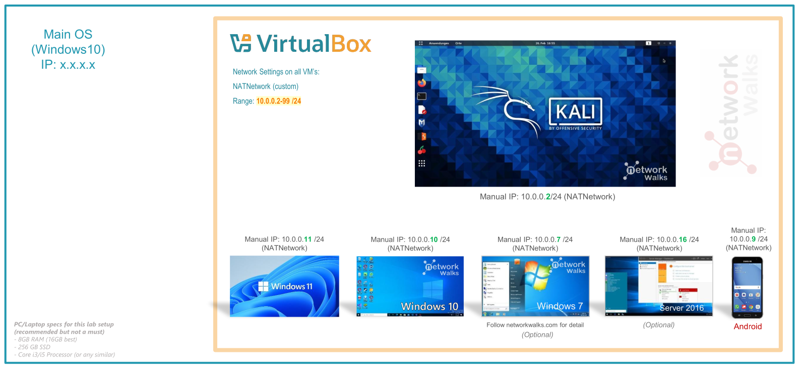
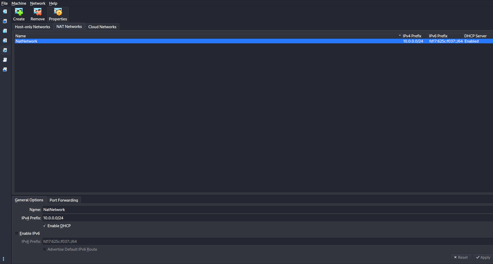
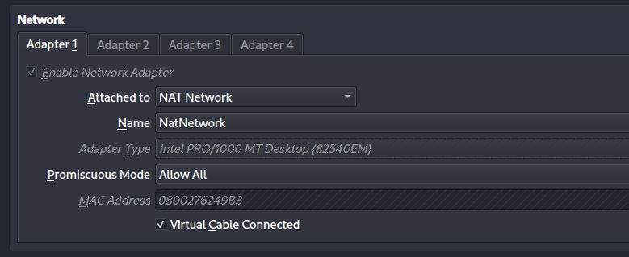
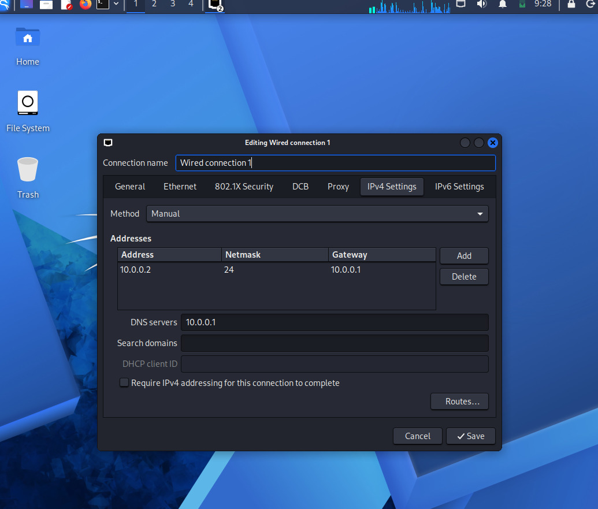

# Donald-Odhiambo-networkwalks-B082-lweek1-cybersecurity-lab-setup
My_Cybersecurity_Lab_Setup

🔐 Professional Cybersecurity Lab Environment Setup
Executive Summary
This document outlines the architecture, configuration, and operational procedures for a production-grade virtual penetration testing laboratory. The environment is engineered to support offensive security operations—including reconnaissance, vulnerability assessment, exploitation, and post-exploitation—within a strictly isolated and ethically governed framework.

🎯 Project Objectives
The lab was designed to achieve the following technical and operational milestones:

Deploy and harden Oracle VirtualBox 7.2 as the hypervisor layer.

Provision Kali Linux 2026.2 as the primary offensive security workstation.

Architect a private NAT Network (10.0.0.0/24) to isolate lab traffic from production infrastructure.

Implement static IP addressing for deterministic network behavior and reproducible testing.

Validate end-to-end connectivity, DNS resolution, and toolchain readiness.

Establish a clean baseline snapshot for rapid environment recovery.

Document all procedures to professional standards for auditability and knowledge transfer.

Prepare the foundation for advanced modules: Active Directory labs, web app testing, and red team simulations.

🛡️ Operational Purpose & Ethical Boundaries
This laboratory exists solely for authorized security research, skill development, and controlled experimentation. Permissible activities include:

Network discovery and enumeration

Port and service scanning

Vulnerability identification and validation

Packet capture and protocol analysis

Web application security testing (OWASP Top 10, business logic flaws)

Exploitation of intentionally vulnerable targets

Tool evaluation and custom script development

⚠️ Ethical Mandate: All testing must occur within this isolated environment or against systems for which you hold explicit, written authorization. Unauthorized scanning or exploitation of external networks violates legal statutes and professional ethics.

The  Lab Architecture

Configuration Matrix
Component	Specification
Host OS	Windows 10
Host RAM	8 GB
CPU	Intel Core i7 (VT-x enabled)
Hypervisor	Oracle VirtualBox 7.2
Security OS	Kali Linux 2026.2 (Pre-built VM)
Kali RAM Allocation	2048 MB
Virtual Network	NAT Network
Network CIDR	10.0.0.0/24
Kali IP	10.0.0.2/24
Default Gateway	10.0.0.1
DNS Server	8.8.8.8
Future Target Range	10.0.0.3 – 10.0.0.99

🪜 Implementation Procedure
Step 1: Prerequisite Tooling — 7-Zip
The Kali Linux virtual machine image is distributed as a compressed .7z archive. 7-Zip was installed to extract the contents prior to import.

Tool: 7-Zip

Purpose: Archive extraction for VM appliance files.

Step 2: Hypervisor Deployment — VirtualBox 7.2
VirtualBox serves as the Type-2 hypervisor, abstracting hardware resources to host isolated virtual machines.

Download: VirtualBox Official Site

Installation: Default wizard with Extension Pack for USB 3.0 and RDP support.

Step 3: Network Architecture — NAT Network
A dedicated NAT Network was engineered to enable inter-VM communication while preserving isolation from the host’s physical network.

Configuration:

Network Name: NatNetwork

IPv4 Prefix: 10.0.0.0/24

DHCP: Enabled (for future targets; Kali uses static)

IPv6: Disabled (reduces attack surface during learning)

Why NAT Network? Unlike standard NAT (which isolates each VM), a NAT Network allows multiple VMs to communicate with each other while still providing outbound Internet access—critical for multi-machine labs.

Step 4: Kali Linux Provisioning
The official pre-built Kali Linux VirtualBox image was imported to ensure consistency and reduce setup time.

VM Settings:

Network Adapter 1: Attached to NatNetwork, Intel PRO/1000 MT Desktop

RAM: 2048 MB (balanced for host stability)

Shared Folder: Configured for seamless host-to-Kali file transfer (e.g., wordlists, scripts)

Step 5: Network Hardening — Static IP Assignment
To ensure deterministic behavior across lab sessions, Kali was configured with a static IPv4 address.

Manual Configuration:

bash
IP Address:   10.0.0.2
Subnet Mask:  255.255.255.0
Gateway:      10.0.0.1
DNS:          8.8.8.8
🐞 Troubleshooting Note: If Internet connectivity drops after static assignment, adjust NetworkManager’s duplicate address detection timeout:

bash
sudo nmcli connection modify "Wired connection 1" ipv4.dad-timeout 0
Replace "Wired connection 1" with your actual interface name (nmcli connection show).

Step 6: Baseline Snapshot — Recovery Point
A clean snapshot was captured immediately after network validation to preserve a known-good state.

Snapshot Name: Clean Kali - Network Setup

Purpose: Rapid rollback after tool misconfiguration, system breakage, or experimental changes.

🔎 Validation & Verification
All systems were tested to confirm operational readiness.

Test	Command	Expected Outcome
IP Configuration	ip a	10.0.0.2/24 on eth0
Gateway Reachability	ping -c 4 10.0.0.1	0% packet loss
Internet Connectivity	ping -c 4 8.8.8.8	Successful ICMP replies
DNS Resolution	nslookup networkwalks.com	Resolves to public IP
Toolchain Readiness	nmap --version	Displays Nmap version
Snapshot Integrity	Restore → ip a	Reverts to 10.0.0.2

🐞 Encountered Challenges & Resolutions
Issue 1: Loss of Internet Post-Static IP
Symptom: Kali loses outbound connectivity after manual IP assignment.

Root Cause: NetworkManager’s duplicate address detection (DAD) timing out in virtualized environments.

Resolution:

bash
sudo nmcli connection modify "Wired connection 1" ipv4.dad-timeout 0
sudo nmcli connection down "Wired connection 1"
sudo nmcli connection up "Wired connection 1"
✅ Always verify interface names with nmcli connection show before applying changes.

Issue 2: VT-x / Hardware Virtualization Disabled
Symptom: VM fails to start with error: “VT-x is not available.”

Resolution:

Reboot host and enter BIOS/UEFI (typically F2, Del, or F10).

Navigate to CPU or Advanced settings.

Enable Intel VT-x or AMD-V.

Save and reboot.

Launch VM successfully.

💡 Key Learnings & Professional Insights
This lab reinforced foundational concepts critical to offensive security operations:

NAT vs. NAT Network: NAT isolates VMs; NAT Network enables controlled inter-VM communication—essential for attacker-target dynamics.

Virtual Networking Models: Understanding adapter types (NAT, Bridged, Host-Only, Internal) dictates lab topology and security boundaries.

Deterministic IP Management: Static IPs ensure reproducibility in documentation, scripting, and team-based exercises.

Snapshot Discipline: Always snapshot before risky operations—treat it as your “undo button” for system states.

Documentation as a Force Multiplier: Professional reports, command logs, and architecture diagrams transform ad-hoc tinkering into auditable, scalable practice.

🔐 Ethical & Legal Compliance
This environment adheres to the following principles:

Authorization First: No testing outside this lab without explicit, written permission.

Educational Use Only: All activities are for skill development, not malicious intent.

Isolation by Design: Lab traffic never bridges to production or public networks.

Tool Responsibility: Capabilities like nmap, metasploit, and burpsuite are powerful—use them wisely and legally.

🔗 Toolchain & Resources
7-Zip: https://7-zip.org/download.html

VirtualBox: https://virtualbox.org/wiki/Downloads

Kali Linux: https://kali.org/get-kali

Documentation Templates: 
PentesterWorld

👤 Author & Attribution
Oketch Donald
Cybersecurity Intern at Networkwalks Academy| B082
LinkedIn: linkedin.com/in/waqaskarim

Program: Cybersecurity at NetworkWalks | Week 01
Project: Cybersecurity & Penetration Testing Lab Setup
Repository: GitHub (Public)
